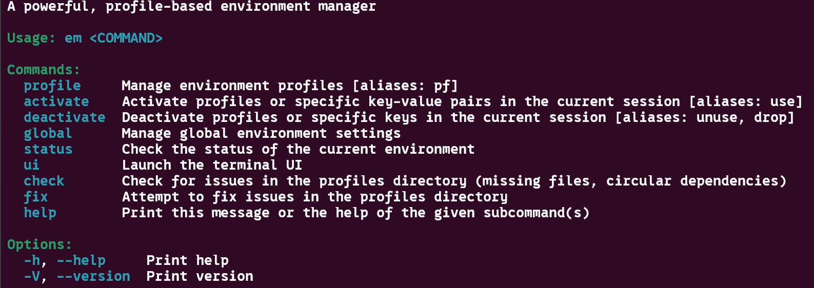
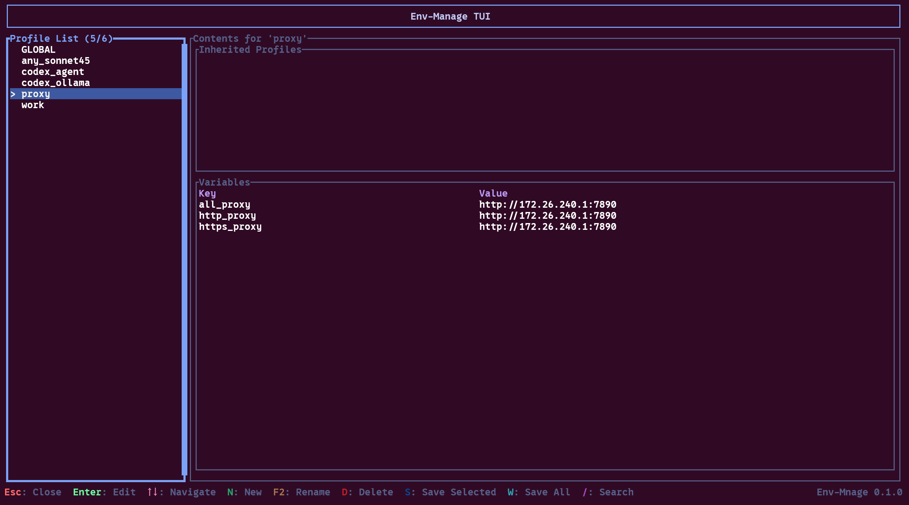

# Environment Variable Manager (env-manage)

[](README_zh.md)

A Rust-based CLI tool for managing your shell environment variables. It allows you to switch between different profiles and handles dependencies automatically. It also provides a TUI (Terminal User Interface) for visual management.

```bash
em -h  # Show help information
```



This tool uses the TOML format to store environment variable configurations. Profiles are stored in the `~/.config/env-manage/profiles` directory by default.

- **`global.toml`**: A special profile located at `~/.config/env-manage/global.toml` that is automatically loaded every time the terminal starts.

Each profile consists of two parts:

- **variables**: A list of key-value pairs representing the environment variables to be set.
- **profiles**: A list of other profiles that the current profile depends on.

Example configuration:

```toml
profiles = []

[variables]
https_proxy = "http://172.26.240.1:7890"
all_proxy = "http://172.26.240.1:7890"
http_proxy = "http://172.26.240.1:7890"
```

## Features

- **Profile Management**: Create and organize environment variables into different profiles.
- **Dependency Resolution**: Handle complex dependencies between profiles.
- **TUI Interface**: Terminal user interface for intuitive configuration management.
- **Shell Integration**: Support for Bash, Zsh, and Fish.

## Installation

Automated installation scripts are available for the following shells. These scripts will download the latest binary and configure your shell environment.

### Bash

```bash
curl -fsSL https://raw.githubusercontent.com/zhangzhenxiang666/env-manager/main/scripts/install_bash.sh | bash
```

### Zsh

```bash
curl -fsSL https://raw.githubusercontent.com/zhangzhenxiang666/env-manager/main/scripts/install_zsh.sh | bash
```

> **Note**: After installation, please restart your terminal or run `source ~/.bashrc` (or the equivalent config file) to load the configuration.

## Usage

### TUI Management Interface

Run the following command to start the TUI:

```bash
em ui
```



### Common Commands

- **Temporarily Load Environment Variables**:

    Load specified profiles or set variables directly in the current session.

    ```bash
    em use <profile_name or key=value>...
    # Aliases: em activate
    ```

    Example: `em use profile1 profile2 http_proxy=http://172.26.240.1:7890`

- **Unload Environment Variables**:

    Remove specified profiles or variables from the current session.

    ```bash
    em unuse <profile_name or key>...
    # Aliases: em deactivate, em drop
    ```

    Example: `em unuse profile1 profile2 http_proxy`

- **Check Status**:

    Check the current environment status and consistency.

    ```bash
    em check
    ```

- **Fix Consistency Issues**:

    Attempt to fix inconsistencies in the environment variable configuration.

    ```bash
    em fix
    ```

- **Initialize Shell**:

    (Automatically configured by the install script, usually does not need to be run manually)

    ```bash
    em init
    ```

## Configuration

By default, profiles are stored in the `~/.config/env-manage/profiles` directory.
